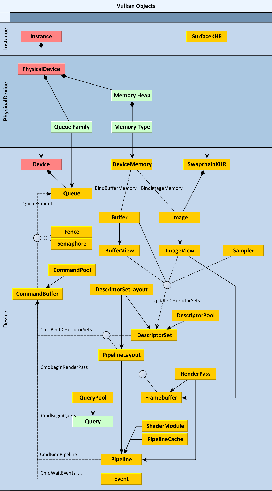

# Vulkan crash course

This page proposes a high-level, simplified overview of Vulkan for beginners. Understanding the basic principles Vulkan is required when writing custom visuals or graphics, **but it is not required when using existing visuals**.


## Using the GPU for scientific visualization

The GPU is a massively parallel computing unit specialized in rendering graphics in real-time. Vulkan is a low-level graphics API that provides extensive control on the GPU for rendering and compute. It is harder to user than older APIs like OpenGL because it proposes a relatively low level of abstraction. This design choice gives more control to the developer and helps achieving higher performance.

The GPU is typically used by video games, rendering complex, animated 3D meshes with real-time special effects and low latency. The GPU can also be used for scientific applications, which has quite different requirements. Scenes are typically less dynamic, there is less heterogeneity in the types of objects rendered in the scene, and high visual accuracy is an absolute requirement.

How to use the GPU for scientific visualization? At a high level, the user has some scientific data: a set of 2D or 3D points, a graph, a volume, an image, and so on. On the other hand, **the GPU can only render three types of primitives**:

1. points (1D),
2. lines (2D),
3. triangles (3D).

Fortunately, the GPU gives full control on, essentially, two things:

1. the way the data is **transformed** before the primitive positions are determined,
2. the exact color of each pixel of each primitive.

In practice, one specifies this via special programs called **shaders**, that run in parallel on the GPU. They are typically written in a C-like language called **GLSL** (OpenGL shading language).

!!! note
    Vulkan does not work directly with GLSL, but with an intermediate representation called SPIR-V (a bit similar to LLVM). Vulkan and other third-parties propose compilers transforming GLSL code into SPIR-V. In Datoviz, all shader code is written in GLSL. It is theoretically possible to use other languages that compile to SPIR-V.

* The **vertex shader** is a GLSL program that runs on every vertex (point) of a given graphics pipeline. It must return the final point position in a reference normalized coordinate system. This point is used when generating the primitive (point, one of the two endpoints of a line, or one of the three corners of a triangle).
* The **fragment shader** is a GLSL program that runs on every pixel of every primitive (point, line, or triangle). It must return the RGBA values of that pixel. It can **discard** pixels altogether (for example, slicing a mesh along a plane).

!!! note
    Vulkan supports other types of shaders, such as geometry shaders and tesselation shaders. However, hardware support for these more recent and advanced shader types is not universal. For example, geometry shaders are not supported on macOS (Metal).

Another important type of shader is the **compute shader**. Compute shaders are used to implement general-purpose parallel computations on the GPU on possibly the same objects (buffer and textures) used for rendering, which allow for highly complex and custom visualization applications.

There are, of course, many other parameters and details related to rendering, but these are the most important principles.


## 2D and 3D graphics on the GPU

Rendering high-quality 2D graphics on the GPU is significantly harder than rendering 3D graphics.

### 3D rendering

Rendering a 3D mesh is relatively straightforward. A mesh is typically defined by a set of 3D **points**, and a set of **faces**. Each face is determined by three integers: the indices of the three triangle corners within the set of 3D points.

#### Vertex shader

In the simplest case, the vertex shader takes as input the 3D points, and applies 3D transformation matrices to account for the camera position and perspective. By convention, there are generally three transformation 4x4 matrices:

* **model matrix**: transformation from the local coordinate system (in which the mesh is defined) into the global coordinate system (the 3D world containing the mesh),
* **view matrix**: transformation from the global coordinate system to the camera-local coordinate system,
* **projection matrix**: applies perspective with 4D homogeneous coordinates.

Understanding the mathematics of these transformations is beyond the scope of this page. There are many explanations online.

Here is a trivial example of a vertex shader in GLSL:

```glsl
#version 450
layout (location = 0) in vec3 pos;
void main() {
    // ... define transformation matrices ...
    gl_Position = proj * view * model * vec4(pos, 1.0);
}
```

The variable `pos` is a 3D vector with the coordinates of 1 point. The GPU executes the vertex shader in parallel on many points. The output of the vertex shader is `gl_Position`, a vec4 vector (the last coordinate is the homogeneous coordinate, used for perspective).


#### Fragment shader

A trivial fragment shader could output a constant color, independently from the position of the pixel within a triangle. But typically, the fragment shader for a 3D mesh implements mathematical computations to account for lighting, which gives a much more realistic feel. While many lighting models have been created, Datoviz currently implements a classic technique called *Phong shading*. Again, the details are beyond the scope of this page.

One can also apply a texture on a mesh. Each point comes with a pair of special coordinates called the **texture coordinates**, noted `uv`. Normalized between 0 and 1, they refer to a specific pixel position within an associated 2D texture. The fragment shader typically fetches the color of the texture pixel (texel) at this exact position.

Importantly, the GPU is able to make efficient linear interpolations of these values for pixels between two vertices of a given primitive. For example, to render an image, one specifies two triangles forming a square, and sets the uv coordinates of each of the six vertices (three per triangle) to the different combinations of `(0 or 1, 0 or 1)`. For every pixel in the square, the correct `uv` coordinates will be interpolated and the relevant texel will be fetched from the texture on the GPU.


### 2D rendering

Rendering 2D graphics is much trickier on the GPU. How to render a disc, a polygon patch, a thick line, text by using only points, lines, and triangles? The answer is: **by leveraging the vertex shader and, more importantly, the fragment shader**. One follows two steps:

* define the primitive type for the 2D object, which will constitute a sort of "envelope" of the final object,
* use the fragment shader to properly *discard* pixels that are beyond the boundaries of the final object, and compute the alpha transparency value for pixels lying on the border of the object, thereby implementing **antialiasing** directly on the GPU.

For example, to render a thick line, one must triangulate the path, taking care of regions of high curvature and other details. On each triangle, the fragment shader computes the exact position along the path, and the distance to the border of the path. The alpha transparency value is obtained via a so-called **signed distance function** (a function of space giving the distance, in pixels, to the border of the object).

A similar principle is used for markers and text. For text, signed distance functions of each glyph are stored in a texture and used by the fragment shader.

In Datoviz, high-quality antialiased 2D graphics are implemented with GLSL code originally written by Nicolas Rougier in his Glumpy library (GPU implementation of *agg*, antigrain geometry), and published in computer graphics articles.

A fundamental principle of Datoviz is to **abstract away these low-level details to the user, who can reuse directly these existing graphics for the most common types of scientific visualizations**.


## Vulkan for scientific visualization

We've now seen the basic principles of using the GPU for scientific visualization. Let's turn now to Vulkan.

Vulkan is a low-level graphics API that has a high entry barrier given the large number of abstractions provided. These abstractions mostly relate to internal details of GPU hardware, but they are essential when one focuses on achieving high performance, which is the main selling point of Datoviz.

Here is, for your information only, the ~30 types of objects used by Vulkan:


*[Diagram by Adam Sawicki, for gpuopen](https://gpuopen.com/learn/understanding-vulkan-objects/)*

Covering all of these objects in detail is totally out of scope of this page. However, we'll briefly explain the most important objects, and how they are used in Datoviz. Importantly, **Datoviz implements its own thin wrapper on top of Vulkan** (called vklite), which focuses on the most important concepts only. The wrapper provides an API that is easier to use than the original Vulkan API, although it it slightly less flexible. This is acceptable given that the wrapper targets scientific applications, which are less demanding than 3D video games.

We'll classify these objects in five broad categories:

* **storing data** on the GPU,
* **defining graphics and compute pipelines** with shaders,
* **recording graphics and compute commands** for the GPU,
* **running the main rendering loop**,
* **synchronization**.


### Storing data on the GPU

Scientific data is typically obtained from files, from the network, or generated by simulation programs. In order for the GPU to render it, it needs to be uploaded to the GPU. A GPU typically has dedicated video memory, or shares memory with the host. For example, the NVIDIA GEFORCE RTX 2070 SUPER GPU has 8 GB of video memory.

In any case, Vulkan defines several objects to control how memory is organized and how the data is stored in video memory. Datoviz has a very simple model where there are only two types of memory:

* **GPU buffers**: a GPU buffer is a memory buffer of a given size, that contains arbitrary binary bytes,
* **GPU textures**: a GPU texture is defined by a 1D, 2D, or 3D image of a given shape, by an internally-handled memory buffer with the pixel data in a given format, and a *sampler* which is a special GPU object that specifies how a texel is accessed and interpolated when fetched by the fragment shader.

A GPU buffer abstracts away the following Vulkan objects: Buffer, BufferView.
A GPU texture abstracts away the following Vulkan objects: Image, ImageView, Sampler.

Uploading data from the host memory to a GPU buffer or texture, and downloading data from the GPU back to the host, are complex operations in Vulkan. Again, Datoviz abstracts these processes away in the transfer API.

!!! note
    A GPU image may be represented in several ways by the GPU. For example, a texture needs to be stored in a special way in order to achieve high performance, but this internal representation is incompatible with the way the image is typically stored in a file or on the host. Vulkan provides an API to *transition* the image between these different formats. Uploading an image to the GPU therefore involves transitioning the image from whatever format the GPU has chosen, to a standard linear layout that matches the data uploaded from the CPU. These details are abstracted away in Datoviz.


### Defining pipeline with shaders

Datoviz supports two types of pipelines:

* **graphics pipelines** (or just **graphics**): for rendering points, lines, or triangles with dedicated vertex and fragment shaders,
* **compute pipelines** (or just **computes**): for general-purpose GPU computations.

A graphics pipeline encompasses many steps. The diagram below exposes the most important steps, and is shown for your information only:


*[Schematic from vulkan-tutorial.com](https://vulkan-tutorial.com/Drawing_a_triangle/Graphics_pipeline_basics/Introduction)*

In addition to defining shaders, one needs to define the data input of the vertex shader. In Datoviz, a vertex shader accepts several kinds of inputs:

* **attribute**: a part of each vertex to process in parallel (for example, a `vec3` position for the point being processed),
* **uniform**: small data (parameters) shared across all vertices in the pipeline,
* **texture**: a sampler giving a way to fetch any texel from a 1D, 2D, or 3D texture,
* **storage buffer**: an arbitrary binary buffer that may be accessed from any vertex thread,
* **push constant**: a small parameter that is set when recording the command buffer (see below).

Uniforms, textures, storage buffers are special types of so-called *Vulkan descriptors*, that we could also call *GPU resources*: they represent essentially GPU buffers or textures. They can be accessed from the vertex shader or, actually, from any kind of shader.

By contrast, the push constant is a different type of data that is passed to the GPU when recording a command buffer. An attribute is a type of data that is processed in parallel.

Vulkan define several abstractions in order to define the way a shader may access descriptors (uniforms, textures, or storage buffers): descriptor set layouts, pipeline layouts, descriptor pools, descriptor sets... These abstractions mostly make sense when focusing on performance, and they are partly abstracted away in Datoviz.

Datoviz proposes the following, simplified model for defining GPU resources accessible by shaders:

* a **slot** is defined in GLSL in each shader. It is represented by a resource index within the shader, and a resource type (uniform, storage, sampler). It must also be defined in the Datoviz C API, and the GLSL and C descriptions must imperatively match.
* a **binding** is an association of a given GPU object (buffer or texture) with a given slot in a given pipeline (graphics or compute).

For example, a pipeline may declare that it expects a uniform at slot 0, and a texture sampler at slot 1. This is defined in the *slots*. Then, before one can render a pipeline, one also needs to declare what GPU buffer to use for slot 0, and what GPU texture to use for slot 1. This is defined in the *bindings*.

Defining slots is done when creating a graphics or compute. Defining bindings is done when rendering an existing graphics or compute.

Pipelines encompass the following Vulkan objects: ShaderModule, Pipeline, PipelineLayout, DescriptorPool, DescriptorSetLayout, DescriptorSet.


### Recording commands for the GPU

Once GPU objects have been created, data has been uploaded, graphics and compute pipelines have been defined, the next step is to **record commands for the GPU**.

This aspect of Vulkan is a significant difference with older graphics APIs such as OpenGL. One does not send commands to the GPU in real time, but one pre-records a linear succession of commands within a so-called **command buffer**, and *submits* recorded command buffers to special *queues*. The GPU watches these queues, receives the command buffers, and processes them in parallel.

In Vulkan, recording commands are special commands starting wih `vkCmd`. In Datoviz, they start with `dvz_cmd_`.

For example, rendering a single graphics pipeline involves the following recording commands:

```c
dvz_cmd_begin(...);                 // begin recording the command buffer
dvz_cmd_begin_renderpass(...);      // begin the renderpass
dvz_cmd_bind_vertex_buffer(...);    // bind an existing GPU buffer as vertex buffer
dvz_cmd_bind_index_buffer(...);     // bind an existing GPU buffer as index buffer
dvz_cmd_bind_graphics(...);         // bind an existing graphics pipeline
dvz_cmd_viewport(...);              // set the viewport
dvz_cmd_draw(...);                  // **perform the actual rendering of the graphics pipeline**
dvz_cmd_end_renderpass(...);        // end the renderpass
dvz_cmd_end(...);                   // stop recording the command buffer
```

Once called on a command buffer, the command buffer is recorded and can be submitted to a GPU queue. Vulkan leaves to the user the choice of defining the number and types of GPU queues for the application. This is also depends heavily on the hardware. Currently, Datoviz requests four queues, but may end up with less queues if the hardware does not support them (this is all transparent to the user):

* a **transfer queue** receives command buffers for buffer/image upload, download, copy, transitions...
* a **compute queue** receives command buffers with compute tasks,
* a **render queue** receives command buffers with either graphics and/or compute tasks,
* a **present queue** is used for the main rendering loop (swapchain).

Vulkan has been designed with the idea that command buffers will be constantly recreated and/or reused. Multithreaded applications can record command buffers in parallel, and must use special synchronization primitives to efficiently submit the command buffers to the GPU. Scientific applications are typically much less dynamic than video games. Still, *some* amount of dynamism is expected in some applications. Therefore, Datoviz assumes that command buffers are typically not recreated at every frame, but allows for relatively efficient command buffer recreation when needed.

Here are the different ways the GPU objects may change during the lifetime of an application:

* **changing buffer or texture data**: update a GPU buffer or texture, doesn't require command buffer recreation,
* **interactivity** (pan and zoom, arcball, and so on): update a uniform buffer,
* **changing the number of vertices** in a given graphics pipeline: require command buffer recreation (unless using *indirect rendering*, in which case this involves updating a GPU buffer),
* **push constant change**: require command buffer recreation,
* **resize**, **panel change**, **viewport change**: require command buffer recreation.

Datoviz command buffers and queues are based on the following Vulkan objects: CommandPool, CommandBuffer, Queue.


### Main rendering loop

Once the command buffers have been recorded, one needs to submit them to the GPU and render the scene in a window. This step must be done manually when using the Vulkan API. Again, this is abstracted away in Datoviz, at the level of the **canvas**.

This step is actually one of the most complex ones in Vulkan, especially when there's a need to do it as efficiently as possible.

First, one must assume that the window size is fixed. Resizing is a complex operation that requires destroying and recreating a large number of Vulkan objects, and it needs to be handled correctly in the rendering loop.

Second, one needs to create a GPU image (like the object that is associated to a texture, but without a sampler) that the GPU will render to. This image will be presented to the screen. One must also define another special image of the same size for the *depth buffer*, essential with 3D rendering.

Third, one must acquire a *surface*, a special Vulkan object that is used to render something to the window. Creating a window is an OS-dependent operation. Datoviz uses the **glfw** windowing library that abstracts these details away and offers an easy way to create windows and to deal with user inputs (mouse, keyboard).

Fourth, one needs to create a **swapchain**. This object provides a way to implement a technique sometimes called double-buffering, or triple-buffering, depending on the number of images used in the swapchain. The idea is to **avoid making the GPU wait while an image is being presented to the screen**. For example, with a frame rate of 60 images per second, each image remains on screen during about 16 milliseconds. During this time, the GPU is not expected to render to the same image, unless it makes a copy. That's basically the idea of the swapchain: providing a set of 2, 3 or more images that are *almost* identical. While the image 0 is presented to the screen, the GPU can render the *next frame* on image 1. When it finishes, it presents image 1 to the screen, while image 0 is being rewritten for the next frame (double buffering), or while it waits until the GPU requests it.

This logic must be, in part, implemented by the developer who uses the Vulkan API directly. Datoviz completely abstracts this process away.

Fifth, one needs to define a **render pass** and a set of **framebuffers**. The render pass defines the way the GPU renders an image, in one or several steps. The framebuffers represent the links between the GPU images and the render pass steps. The render pass must be specified when recording a rendering command buffer.

Sixth, one needs to implement the main **rendering loop**. This is typically an infinite loop that where very iteration represents a frame. At every frame, the rendering loop performs the following (simplified) steps:

* Examine the user events (mouse, keyboard) that occurred in the window since the last frame,
* Perform the resize if the window size has changed since the last frame,
* Implement the scene logic (update internal variables as a function of user events and time),
* Perform the pending transfers (upload/download of GPU buffers/textures) that have been requested since last frame, possibly from a background thread,
* Optionally, record new command buffers,
* Acquire a new swapchain image for rendering,
* Wait until the previous frame has finished rendering,
* Submit the command buffers to their associated GPU queues, which will render the image,
* Present the image to the screen, but only *after* the GPU has finished rendering it (asynchronous operation).

This logic is essentially implemented in:

* `dvz_canvas_frame()`
* `dvz_canvas_frame_submit()`
* `dvz_app_run()`

The rendering loop involves the following Vulkan objects: SurfaceKHR, SwapchainKHR, Image, ImageView, RenderPass, Framebuffer.


### Synchronization

The last important topic pertains to **synchronization**. The GPU should be seen as a partly independent device on which tasks are submitted asynchronously (via command buffers and queues), and that processes them in parallel. In addition, each task may involve a massively parallel architecture (for example, processing thousands of vertices or fragments in parallel). Vulkan provides an API to let the CPU communicate with the GPU.

A highly inefficient way would be for the CPU to wait until the GPU is idle before submitting new tasks or uploading data. This would be done via "hard" synchronization primitives that are implemented in the Vulkan functions `vkQueueWaitIdle()` and `vkDeviceWaitIdle()`, and in the `dvz_queue|gpu|app_wait()` functions in Datoviz. Doing it this way would work and would not require any other more fine-grained synchronization primitive, but it would result in poor performance.

Vulkan provides several more fine-grained synchronization primitives, of which Datoviz currently supports three:

* **Inner command buffer synchronization**, provided by barriers,
* **GPU-GPU synchronization**, provided by semaphores.
* **CPU-GPU synchronization**, provided by fences,

A barrier is a way for a command buffer to let the GPU know that some recorded commands should wait for completion of other commands. For example, if a command buffer involves launching a compute shader on a buffer, then rendering to a graphics pipeline, a barrier should be defined if ever the graphics pipeline uses the *same* buffer as used by the compute shader. The graphics pipeline should not start reading a buffer while the same buffer is being written to by the compute pipeline.

A semaphore is a way to introduce dependencies between different submissions of command buffers. They are used in the main rendering loop and swapchain logic. When the GPU has finished rendering an image, *then* this image should be presented to the screen. This is implemented with a semaphore.

A fence is a way for the CPU to wait until the GPU has finished some task. This is also used in the main rendering loop: it wouldn't make much sense to start the current frame until the previous frame has not finished rendering (but it can start while the swapchain presents the previously rendered image to the screen).

Synchronization is required when uploading data to the GPU. Since the GPU may be constantly reading from GPU buffers and textures, data should not be uploaded to these GPU objects without proper synchronization. Otherwise, the GPU might use corrupted data while rendering the scene.


## Technical details

The vklite API documentation contains the documentation of all Vulkan-related functions. There is no other documentation of vklite at the moment, however you can look at the unit tests to get an idea of how to use each vklite object.


### GPU features and limits

The `DvzGpu` structure contains a few fields with native Vulkan structures defining GPU capabilities and limits.

We give here a few minimal values that we can reasonably expect on almost all devices (according to this [Vulkan database](http://vulkan.gpuinfo.org/listlimits.php)):

| Texture dimension | Maximum allowed texture size (in any axis) |
|-------------------|--------------------------------------------|
|       1D          |                  16384                     |
|       2D          |                  16384                     |
|       3D          |                   2048                     |
