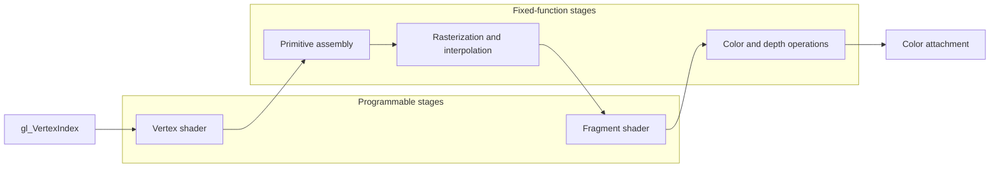

# 4. Your first triangle

**Your program at the end of this chapter: 267 C lines. The raw Vulkan equivalent: around 1200 lines, a rough estimate. You draw a triangle with two shaders and a graphics pipeline.**


The frame from chapter 3 now has something to draw. A **shader** is a small GPU program that runs at a defined stage of the graphics pipeline. You will compile two shaders, create the pipeline that joins them to Vulkan's fixed-function stages, and issue one draw command. The vertex positions live in the shader for now, so no vertex buffer is needed.

Start from your chapter 3 `main.c`. The pulsing clear has served its purpose, so remove `<math.h>`, the three animation fields in `Renderer`, the `--time` option, and the time calculation in `draw()`. Remove the GPU-name and rendered-frame prints as well; validation errors remain the one diagnostic printed on every run. Keep the `--png` option and replace the animated clear with this fixed dark color:

```c
    VkClearValue clear = {.color.float32 = {0.04f, 0.05f, 0.08f, 1.0f}};
```

Add the pipeline fields below to `Renderer`. From this chapter onward, that structure holds every object used by the draw callback. The full listing also trims the chapter 3 guide comments now that the setup calls are familiar.

```c
typedef struct
{
    DvzDevice* device;
    VkFormat color_format;
    DvzCommands* commands;
    DvzRendering* rendering;
    DvzSlots* slots;
    DvzShader* vertex_shader;
    DvzShader* fragment_shader;
    DvzGraphics* pipeline;
} Renderer;
```

## Two shader stages

A **shader invocation** is one execution of a shader for one item of work. The **vertex shader** runs once for each requested vertex and must write that vertex's clip-space position. `gl_VertexIndex` is 0, 1, then 2, so each invocation selects one position and one color from the arrays. No CPU pointer survives into the draw: these arrays are constants compiled into the shader.

These positions are already in **clip space**, the homogeneous coordinate system produced by a vertex shader. Because every position has `w = 1`, division by `w` leaves x and y spanning the visible range from -1 to +1 and z in Vulkan's visible depth range from 0 to 1. The positive-height viewport used here maps normalized-device positive y downward, which is why the first point uses a negative y coordinate to appear at the top. Chapter 9 returns to clip coordinates when `w` varies with depth.

```c
static const char* VERTEX_GLSL =
    "#version 450\n"
    "layout(location = 0) out vec3 color;\n"
    "vec2 positions[3] = vec2[](\n"
    "    vec2( 0.0, -0.65), vec2( 0.65, 0.65), vec2(-0.65, 0.65));\n"
    "vec3 colors[3] = vec3[](\n"
    "    vec3(1.0, 0.2, 0.2), vec3(0.2, 1.0, 0.2), vec3(0.2, 0.3, 1.0));\n"
    "void main() {\n"
    "    gl_Position = vec4(positions[gl_VertexIndex], 0.0, 1.0);\n"
    "    color = colors[gl_VertexIndex];\n"
    "}\n";
```

After the vertex stage, **primitive assembly** groups the three outputs into a triangle. **Rasterization** determines which framebuffer samples the triangle covers and produces **fragments**, candidate contributions to those samples. It also interpolates the three vertex colors across the triangle. The **fragment shader** runs for those fragments and produces a color at location 0. A fragment is not simply a pixel: later tests can reject it, and multisampling can evaluate coverage at more than one sample within a pixel.

```c
static const char* FRAGMENT_GLSL =
    "#version 450\n"
    "layout(location = 0) in vec3 color;\n"
    "layout(location = 0) out vec4 out_color;\n"
    "void main() { out_color = vec4(color, 1.0); }\n";
```

The full path for this draw is:



The programmable stages run code you supply. The fixed-function stages follow pipeline state that you configure, such as triangle topology, viewport, depth testing, and blending. A **graphics pipeline** packages those shaders and most of that fixed state into one device object. The command buffer later binds the pipeline so subsequent draws use that complete configuration.

## Resolve the canvas color format

The graphics pipeline must name the same color format as the image it draws into. A live window may choose a different channel order from an offscreen canvas, so do not assume the default format will fit both. For a window, the canvas only learns the selected format when it acquires its first frame.

After creating the canvas and setting `renderer.device`, add the following initialization before allocating the renderer wrappers or creating the pipeline. No draw callback is installed yet, so the canvas records its default clear. Submit that frame, then read the resolved format into `renderer.color_format`:

```c
    // Acquire and submit one default clear before creating a format-dependent pipeline.
    int initial_status = DVZ_CANVAS_FRAME_WAIT_SURFACE;
    while (initial_status == DVZ_CANVAS_FRAME_WAIT_SURFACE)
    {
        dvz_window_host_poll(host);
        if (live && dvz_window_should_close(window))
        {
            exit_code = 0;
            goto cleanup;
        }
        initial_status = dvz_canvas_frame(canvas);
    }
    COURSE_CHECK(initial_status == DVZ_CANVAS_FRAME_READY, "initial frame preparation failed");
    int initial_submit_result = dvz_canvas_submit(canvas);
    COURSE_CHECK(initial_submit_result == 0, "initial frame submission failed");
    renderer.color_format = dvz_canvas_frame_format(canvas);
    COURSE_CHECK(renderer.color_format != VK_FORMAT_UNDEFINED, "canvas color format is unresolved");
```

If the surface is temporarily unavailable, keep polling until a frame can be acquired or the window closes. This adds one initial clear frame. The ordinary draw loop still starts at frame zero, and an offscreen capture reads the subsequent frame containing the triangle.

## Compile and build the pipeline

Add `<stdint.h>` and `<datoviz/shader.h>`. **GLSL** is the human-readable shading language used for both source strings. `dvz_compile_glsl()` translates each string into **SPIR-V**, Vulkan's standardized binary intermediate representation. SPIR-V is not the GPU's native machine code; the driver can translate it further for the selected device. `dvz_shader()` copies the SPIR-V into a **shader module**, the Vulkan object that presents one compiled stage to pipeline creation. The CPU-side SPIR-V arrays can then be freed because the shader modules no longer refer to those arrays.

```c
    uint64_t vertex_size = 0;
    uint64_t fragment_size = 0;
    uint32_t* vertex_spirv = dvz_compile_glsl("vertex", VERTEX_GLSL, &vertex_size);
    uint32_t* fragment_spirv = dvz_compile_glsl("fragment", FRAGMENT_GLSL, &fragment_size);
    if (vertex_spirv == NULL || fragment_spirv == NULL)
    {
        dvz_memory_free(vertex_spirv);
        dvz_memory_free(fragment_spirv);
        return -1;
    }
```

Create the shader, layout, and pipeline wrappers, then create both shader modules. The complete helper checks each allocation and creation so a compiler or GPU failure reaches the shared cleanup path rather than leaving a half-built renderer in use.

```c
    renderer->vertex_shader = dvz_shader_create_wrapper();
    renderer->fragment_shader = dvz_shader_create_wrapper();
    renderer->slots = dvz_slots_create_wrapper();
    renderer->pipeline = dvz_graphics_create_wrapper();
    if (renderer->vertex_shader == NULL || renderer->fragment_shader == NULL ||
        renderer->slots == NULL || renderer->pipeline == NULL)
    {
        dvz_memory_free(vertex_spirv);
        dvz_memory_free(fragment_spirv);
        return -1;
    }
```

```c
    int vertex_result =
        dvz_shader(renderer->device, vertex_size, vertex_spirv, renderer->vertex_shader);
    int fragment_result =
        dvz_shader(renderer->device, fragment_size, fragment_spirv, renderer->fragment_shader);
    dvz_memory_free(vertex_spirv);
    dvz_memory_free(fragment_spirv);
    if (vertex_result != 0 || fragment_result != 0)
        return -1;
```

The empty `DvzSlots` layout declares that this pipeline has no descriptors or push constants. It contributes to the **pipeline layout**, the contract for resources and small values that shaders may access; later chapters add both. Here the graphics pipeline combines the shader stages with state that says: group vertices in threes, render to the canvas color format, and set viewport and scissor dynamically for each frame.

```c
    dvz_slots(renderer->device, renderer->slots);
    if (dvz_slots_create(renderer->slots) != 0)
        return -1;

    dvz_graphics(renderer->device, renderer->pipeline);
    dvz_graphics_shader(
        renderer->pipeline, VK_SHADER_STAGE_VERTEX_BIT,
        dvz_shader_handle(renderer->vertex_shader));
    dvz_graphics_shader(
        renderer->pipeline, VK_SHADER_STAGE_FRAGMENT_BIT,
        dvz_shader_handle(renderer->fragment_shader));
```

```c
    dvz_graphics_primitive(
        renderer->pipeline, VK_PRIMITIVE_TOPOLOGY_TRIANGLE_LIST, DVZ_GRAPHICS_FLAGS_FIXED);
    dvz_graphics_attachment_color(renderer->pipeline, 0, renderer->color_format);
    dvz_graphics_layout(renderer->pipeline, dvz_slots_handle(renderer->slots));
    dvz_graphics_viewport(renderer->pipeline, 0, 0, 0, 0, 0, 1, DVZ_GRAPHICS_FLAGS_DYNAMIC);
    dvz_graphics_scissor(renderer->pipeline, 0, 0, 0, 0, DVZ_GRAPHICS_FLAGS_DYNAMIC);
    return dvz_graphics_create(renderer->pipeline);
```

Call `create_pipeline()` after allocating the command and rendering wrappers, before registering the draw callback. At cleanup, wait for submitted work, then destroy and free the pipeline, shader modules, and slots before destroying the GPU context. The full listing shows the complete dependency order. After `dvz_graphics_create()` succeeds, Vulkan permits you to destroy the shader modules because the pipeline has retained the compiled stage code it needs. This program keeps the modules until pipeline cleanup; chapter 5 uses that single ownership group while replacing a pipeline safely.

## Draw three vertices

Bind the pipeline after rendering begins, set the dynamic viewport and scissor, then ask for three vertices. The four numeric arguments are first vertex, vertex count, first instance, and instance count.

```c
    dvz_cmd_bind_graphics(renderer->commands, renderer->pipeline);
    dvz_cmd_set_viewport_scissor(renderer->commands, frame->extent);
    dvz_cmd_draw(renderer->commands, 0, 3, 0, 1);
```

## Build, run, and capture

Save the completed listing as `main.c` in the `vkcourse` directory you created in chapter 1. Build and start the live program from that directory:

=== "Linux and macOS"

    ```sh
    cmake --build build
    ./build/vkcourse
    ```

=== "Windows (Visual Studio)"

    ```powershell
    cmake --build build --config Release
    .\build\Release\vkcourse.exe
    ```

Close the window, then capture the same result without opening one:

=== "Linux and macOS"

    ```sh
    ./build/vkcourse --png chapter04.png
    ```

=== "Windows (Visual Studio)"

    ```powershell
    .\build\Release\vkcourse.exe --png chapter04.png
    ```

The terminal should end with `validation errors: 0`, and `chapter04.png` should contain the triangle shown above.

## Try it

- Swap the red and blue entries in `colors`. The matching corners should exchange colors, while the geometry stays fixed.
- Change `VK_PRIMITIVE_TOPOLOGY_TRIANGLE_LIST` to `VK_PRIMITIVE_TOPOLOGY_LINE_LIST`. Three vertices describe one complete line and leave one unmatched vertex, so you will no longer get a filled triangle.
- Exchange the last two positions. The triangle should still appear because face culling is not enabled yet, but its winding changes. Chapter 10 will make that distinction visible.

!!! info "Under the hood"
    Raw Vulkan needs shader-module create structures, a pipeline layout, several fixed-function state structures, dynamic-rendering attachment formats, and a graphics-pipeline create call. Datoviz fills the routine defaults, but the resulting object is still a Vulkan pipeline.

!!! failure "When it goes wrong"
    A blank frame usually means shader compilation failed, the pipeline's color format does not match the canvas, or the draw was recorded outside the rendering pass. Read the compiler output first. A triangle with an unexpected vertical orientation usually comes from assuming OpenGL's viewport convention.

??? example "Full current listing"

    ```c
    --8<-- "examples/c/vulkan/step04.c"
    ```

## Checkpoint

1. What supplies vertex positions when there is no vertex buffer?
2. Which stage interpolates the colors between vertices?
3. Which pipeline state remains dynamic in this program?
4. Why can the CPU-side SPIR-V arrays be freed after shader-module creation?

Next, move the shaders out of the C string literals so you can edit and reload them directly.
