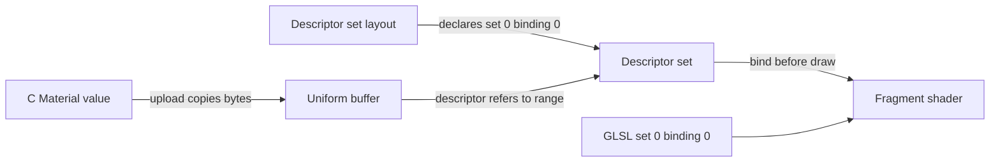

# 12. Uniform buffers and descriptors

**Your program at the end of this chapter: 577 C lines. The raw Vulkan equivalent: around 1850 lines, a rough estimate. A material supplied through a uniform buffer gives the interactive cube a cool tint.**


The vertex shader already receives a model-view-projection matrix through push constants. This chapter adds a second route into the fragment shader: a persistent material stored in a buffer. The tint changes the visible cube immediately, while the camera, depth test, culling, and safe **R** reload continue to work.

## From a C value to a shader input

A **uniform buffer** is a Vulkan buffer whose bytes a shader reads as a structured block of parameters. Unlike a push-constant update, which copies a small value into recorded commands, a uniform-buffer binding refers to a buffer range. The buffer must therefore remain alive until every submitted draw that can read it has finished.

A **descriptor** is the typed reference that connects a shader declaration to a resource such as that buffer range. A **descriptor set layout** declares the type and shader visibility of every binding in one set; `DvzSlots` is Datoviz's wrapper for that layout contract and the push-constant range. A **descriptor set** is a populated instance of the layout. A **binding** is a numbered entry inside a set. C and GLSL must agree on all four parts: set number, binding number, descriptor type, and shader visibility.



The local C value needs to survive only until `dvz_buffer_upload()` returns. Recorded draws retain access to the uniform buffer and descriptor set, so those resources remain owned by `Renderer` through GPU completion.

## Define an aligned material

Add this structure after `Push`:

```c
typedef struct
{
    float tint[4];
} Material;

_Static_assert(sizeof(Material) == 16, "the material block must match four shader floats");
```

GLSL uniform blocks use layout rules that can require more alignment than an ordinary C structure suggests. A `vec4` occupies one 16-byte unit under the default `std140` uniform-block layout. Four consecutive C floats have the same size here, and the assertion catches an accidental structural change. Starting with a `vec4` also avoids the padding surprise of a lone GLSL `vec3`.

Add the allocator beside `device`, then add the buffer and descriptor fields beside the existing buffers in `Renderer`:

```c
    DvzVma* allocator;
```

```c
    DvzBuffer* material_buffer;
    DvzDescriptors* descriptors;
```

Save the borrowed allocator after assigning `renderer.device`:

```c
    renderer.allocator = dvz_gpu_ctx_alloc(gpu);
```

## Create and upload the buffer

Add this helper before `keyboard()`:

```c
static int create_material(Renderer* renderer)
{
    Material material = {.tint = {0.75f, 0.9f, 1.0f, 1.0f}};
    renderer->material_buffer = dvz_buffer_create_wrapper();
    if (renderer->material_buffer == NULL)
        return -1;
    dvz_buffer(renderer->device, renderer->allocator, renderer->material_buffer);
    dvz_buffer_size(renderer->material_buffer, sizeof(Material));
    dvz_buffer_usage(renderer->material_buffer, VK_BUFFER_USAGE_UNIFORM_BUFFER_BIT);
    dvz_buffer_flags(
        renderer->material_buffer, DVZ_ALLOC_MAPPED | DVZ_ALLOC_HOST_ACCESS_SEQUENTIAL_WRITE);
    if (dvz_buffer_create(renderer->material_buffer) != 0)
        return -1;
    dvz_buffer_upload(renderer->material_buffer, 0, sizeof(material), &material);
    return 0;
}
```

This program uploads the material once before any draw is submitted. That makes one persistent buffer safe for every frame. If you later rewrite the same mapped range every frame, you must prevent the CPU from changing bytes that an earlier GPU submission can still read. Common solutions use one uniform region per frame in flight, dynamic offsets, or an explicit wait. A mapped pointer provides access; it does not provide synchronization.

Call the helper before pipeline creation:

```c
    int material_result = create_material(&renderer);
    COURSE_CHECK(material_result == 0, "material buffer creation failed");
    int pipeline_result = create_pipeline(&renderer);
    COURSE_CHECK(pipeline_result == 0, "graphics pipeline creation failed");
```

## Declare and populate the descriptor

In `create_pipeline()`, add the uniform binding after `dvz_slots()` and keep the existing vertex-stage push range:

```c
    dvz_slots_binding(
        renderer->slots, 0, 0, 1, VK_SHADER_STAGE_FRAGMENT_BIT,
        VK_DESCRIPTOR_TYPE_UNIFORM_BUFFER);
    dvz_slots_push(renderer->slots, VK_SHADER_STAGE_VERTEX_BIT, 0, sizeof(Push));
```

Set 0 binding 0 is visible only to the fragment stage. The MVP push range remains a separate part of the pipeline layout and remains visible only to the vertex stage.

After successful pipeline creation, allocate a descriptor set from the layout and write its uniform-buffer entry:

```c
    if (dvz_graphics_create(renderer->pipeline) != 0)
        return -1;
    renderer->descriptors = dvz_descriptors_create_wrapper();
    if (renderer->descriptors == NULL)
        return -1;
    dvz_descriptors(renderer->slots, renderer->descriptors);
    dvz_descriptors_buffer(
        renderer->descriptors, 0, 0, 0, dvz_buffer_handle(renderer->material_buffer), 0,
        sizeof(Material));
    return dvz_descriptors_handle(renderer->descriptors, 0) != VK_NULL_HANDLE ? 0 : -1;
```

The descriptor write stores a reference to the selected buffer range; it does not copy `Material`. Bind the descriptor set in `draw()`, after viewport setup and before the push update, to make that reference available to the following draw:

```c
    dvz_cmd_bind_descriptors(
        renderer->commands, VK_PIPELINE_BIND_POINT_GRAPHICS, renderer->descriptors, 0, 1, 0, NULL);
```

Replace `shader.frag` with:

```glsl
#version 450

layout(set = 0, binding = 0) uniform Material { vec4 tint; } material;
layout(location = 0) in vec3 color;
layout(location = 0) out vec4 out_color;

void main()
{
    out_color = vec4(color, 1.0) * material.tint;
}
```

Every fragment-shader invocation reads the same tint. Multiplication reduces red and green while leaving blue unchanged, so the cube visibly shifts toward a cooler palette. `shader.vert` is unchanged and still reads the per-draw MVP from push constants.

## Preserve ownership during reload

At the beginning of `destroy_pipeline()`, release the descriptor before destroying its pipeline and slots:

```c
    dvz_descriptors_free(renderer->descriptors);
    renderer->descriptors = NULL;
```

The reload candidate borrows the persistent material buffer while owning its new descriptor, layout, shaders, and pipeline:

```c
            Renderer candidate = {
                .device = renderer.device,
                .color_format = renderer.color_format,
                .material_buffer = renderer.material_buffer,
            };
```

After the existing device wait and `destroy_pipeline(&renderer)`, transfer the successful candidate's descriptor with its other pipeline objects:

```c
                renderer.descriptors = candidate.descriptors;
```

A failed shader compile releases only the incomplete candidate and leaves the active descriptor and pipeline usable. A successful reload waits before destroying resources referenced by older submissions. At final cleanup, keep the device wait, destroy the pipeline group first, then destroy and free `material_buffer` before the GPU context.

## Build and run

Keep `main.c`, `shader.vert`, and `shader.frag` in the project directory from chapter 1. Build and run there:

=== "Linux and macOS"

    ```sh
    cmake --build build
    ./build/vkcourse --png chapter12.png
    ./build/vkcourse
    ```

=== "Windows (Visual Studio)"

    ```powershell
    cmake --build build --config Release
    .\build\Release\vkcourse.exe --png chapter12.png
    .\build\Release\vkcourse.exe
    ```

The cube should keep its shape and controls but use the cooler tint shown above. The terminal should report `validation errors: 0`.

!!! tip "Try it"

    Change the tint to `{1.0f, 0.45f, 0.45f, 1.0f}`, rebuild, and capture again. The cube should become redder without changing its geometry, camera, or vertex colors. This initialization-time upload requires a rebuild and restart after changing the C initializer.

??? info "Under the hood: what the descriptor names"

    Raw Vulkan creates a descriptor set layout, includes it in the pipeline layout, allocates a descriptor set from a descriptor pool, and updates that set with a `VkDescriptorBufferInfo`. The descriptor contains a buffer handle, offset, and range. It does not contain a copy of the material bytes.

!!! warning "When it goes wrong"

    A layout or draw-time validation error often means C and GLSL disagree about set 0 binding 0, its descriptor type, or its visible stage. An unchanged color can mean the descriptor was never bound or the fragment shader still writes the vertex color directly. Corrupted values after adding members usually indicate a C/GLSL layout mismatch; use aligned fields and verify sizes and offsets explicitly.

## Checkpoint

1. Which operation copies the local `Material` bytes, and which operation stores only a resource reference?
2. What is the difference between a descriptor set layout, a descriptor set, and binding 0?
3. Why can the local `material` variable disappear after upload while `material_buffer` must survive submitted draws?
4. Why is one initialization-time upload safe, while rewriting one shared uniform buffer every frame may not be?

??? example "Full current listing"

    ```c
    --8<-- "examples/c/vulkan/step12.c"
    ```

??? example "Current shader.vert"

    ```glsl
    --8<-- "examples/c/vulkan/step12/shader.vert"
    ```

??? example "Current shader.frag"

    ```glsl
    --8<-- "examples/c/vulkan/step12/shader.frag"
    ```
