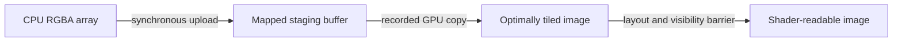

# 13. Uploading a texture

**Your program at the end of this chapter: 667 C lines. The raw Vulkan equivalent: around 1950 lines, a rough estimate. The tinted cube now has a texture image prepared on the GPU.**


Start with chapter 12's `main.c` and keep both shader files. Keep the 16-byte `Material` assertion too; the uniform layout has not changed. The cube still uses vertex colors and the material uniform. You will generate a checkerboard in C, copy it into an image on the GPU, and leave that image ready for sampling in chapter 14. The cube, tint, camera, mouse controls, depth test, culling, and **R** reload all keep working.

The initialization frame from chapter 4 resolves the canvas color format before pipeline creation. Keep `renderer.color_format` and copy it into reload candidates: a live window may use BGRA while offscreen images use RGBA. The pipeline must match the actual attachment in either mode.

## Add the image and its upload

Add this constant beside `WIDTH` and `HEIGHT`:

```c
#define TEXTURE_SIZE 64
```

Keep the allocator added in chapter 12 and add the image beside the buffers. The allocator remains borrowed from the GPU context; the renderer owns the image.

```c
    DvzImages* texture;
```

Add this complete helper between `keyboard()` and `draw()`. It generates 64 × 64 RGBA pixels, with eight-pixel checker tiles. Each texel occupies four bytes; the offset includes both its row and its position within that row.

```c
/**
 * Upload a small checkerboard into a device-local image.
 * @param renderer Renderer that owns the image.
 * @return Zero on success.
 */
static int create_texture(Renderer* renderer)
{
    uint8_t pixels[TEXTURE_SIZE * TEXTURE_SIZE * 4];
    for (uint32_t y = 0; y < TEXTURE_SIZE; y++)
    {
        for (uint32_t x = 0; x < TEXTURE_SIZE; x++)
        {
            bool check = ((x / 8 + y / 8) & 1) != 0;
            size_t i = ((size_t)y * TEXTURE_SIZE + x) * 4;
            pixels[i + 0] = check ? 235 : 35;
            pixels[i + 1] = check ? 170 : 80;
            pixels[i + 2] = check ? 55 : 190;
            pixels[i + 3] = 255;
        }
    }

    DvzBuffer* staging = dvz_buffer_create_wrapper();
    DvzCommands* upload = dvz_commands_create_wrapper();
    renderer->texture = dvz_images_create_wrapper();
    if (staging == NULL || upload == NULL || renderer->texture == NULL)
        goto error;

    dvz_buffer(renderer->device, renderer->allocator, staging);
    dvz_buffer_size(staging, sizeof(pixels));
    dvz_buffer_usage(staging, VK_BUFFER_USAGE_TRANSFER_SRC_BIT);
    dvz_buffer_flags(staging, DVZ_ALLOC_MAPPED | DVZ_ALLOC_HOST_ACCESS_SEQUENTIAL_WRITE);
    if (dvz_buffer_create(staging) != 0)
        goto error;
    dvz_buffer_upload(staging, 0, sizeof(pixels), pixels);

    dvz_images(renderer->device, renderer->allocator, VK_IMAGE_TYPE_2D, 1, renderer->texture);
    dvz_images_format(renderer->texture, VK_FORMAT_R8G8B8A8_SRGB);
    dvz_images_size(renderer->texture, TEXTURE_SIZE, TEXTURE_SIZE, 1);
    dvz_images_usage(
        renderer->texture, VK_IMAGE_USAGE_TRANSFER_DST_BIT | VK_IMAGE_USAGE_SAMPLED_BIT);
    if (dvz_images_create(renderer->texture) != 0)
        goto error;

    dvz_commands(renderer->device, dvz_device_queue(renderer->device, DVZ_QUEUE_MAIN), 1, upload);
    if (dvz_cmd_begin_result(upload) != 0)
        goto error;
    DvzBarriers barriers = {0};
    dvz_barriers(&barriers);
    DvzBarrierImage* image_barrier =
        dvz_barriers_image(&barriers, dvz_image_handle(renderer->texture, 0));
    if (image_barrier == NULL)
        goto error;
    dvz_barrier_image_stage(image_barrier, VK_PIPELINE_STAGE_2_NONE, VK_PIPELINE_STAGE_2_COPY_BIT);
    dvz_barrier_image_access(image_barrier, 0, VK_ACCESS_2_TRANSFER_WRITE_BIT);
    dvz_barrier_image_layout(
        image_barrier, VK_IMAGE_LAYOUT_UNDEFINED, VK_IMAGE_LAYOUT_TRANSFER_DST_OPTIMAL);
    dvz_barrier_image_aspect(image_barrier, VK_IMAGE_ASPECT_COLOR_BIT);
    dvz_cmd_barriers(upload, &barriers);
    DvzImageRegion region = {0};
    dvz_image_region(&region);
    dvz_image_region_extent(&region, TEXTURE_SIZE, TEXTURE_SIZE, 1);
    dvz_cmd_copy_buffer_to_image(
        upload, dvz_buffer_handle(staging), 0, dvz_image_handle(renderer->texture, 0),
        VK_IMAGE_LAYOUT_TRANSFER_DST_OPTIMAL, &region);
    dvz_barrier_image_stage(
        image_barrier, VK_PIPELINE_STAGE_2_COPY_BIT, VK_PIPELINE_STAGE_2_FRAGMENT_SHADER_BIT);
    dvz_barrier_image_access(
        image_barrier, VK_ACCESS_2_TRANSFER_WRITE_BIT, VK_ACCESS_2_SHADER_SAMPLED_READ_BIT);
    dvz_barrier_image_layout(
        image_barrier, VK_IMAGE_LAYOUT_TRANSFER_DST_OPTIMAL,
        VK_IMAGE_LAYOUT_SHADER_READ_ONLY_OPTIMAL);
    dvz_cmd_barriers(upload, &barriers);
    if (dvz_cmd_end_result(upload) != 0 || dvz_cmd_submit_result(upload) != 0)
        goto error;
    dvz_commands_destroy(upload);
    dvz_commands_free(upload);
    dvz_buffer_destroy(staging);
    dvz_buffer_free(staging);
    return 0;

error:
    if (upload != NULL)
    {
        dvz_commands_destroy(upload);
        dvz_commands_free(upload);
    }
    if (staging != NULL)
    {
        dvz_buffer_destroy(staging);
        dvz_buffer_free(staging);
    }
    return -1;
}
```

A **buffer** is a linear range of bytes. An **image** adds dimensions, texel format, tiling, and image-specific access rules. `dvz_buffer_upload()` copies the CPU pixels into a host-visible **staging buffer**, temporary storage chosen so the CPU can write it. The sampled image uses a device-local, optimally tiled allocation chosen for GPU image access; `dvz_cmd_copy_buffer_to_image()` transfers the linear staging bytes into that image representation. We use `VK_FORMAT_R8G8B8A8_SRGB` because the checker values represent display colors. Sampling this concrete format later converts its RGB channels to linear values for shader calculations; alpha remains linear.



The image has two allowed uses: transfer destination and sampled image. An image **layout** names the kind of access for which its contents are prepared. Its first barrier changes `UNDEFINED` to `TRANSFER_DST_OPTIMAL`; no old pixels need preserving. The second changes `TRANSFER_DST_OPTIMAL` to `SHADER_READ_ONLY_OPTIMAL`. A **barrier** establishes ordering and memory visibility as well as the layout transition: the copy must finish, and its writes must become visible, before fragment-shader sampling. An image usage flag permits an operation over the resource's lifetime, while a layout describes its state for a particular access.

This helper owns its upload command buffer, so it may begin, end, and submit it. `dvz_cmd_submit_result()` waits for this upload to finish. Only then does the helper destroy the staging buffer and upload commands. The canvas's frame command buffer remains borrowed, as in earlier chapters.

## Call the helper and release the image

In `main()`, keep chapter 12's material and pipeline creation where they are, before the vertex and index buffers. Insert the texture call immediately after the index-buffer upload and before camera creation:

```c
    int texture_result = create_texture(&renderer);
    COURSE_CHECK(texture_result == 0, "texture upload failed");
```

At `cleanup:`, after the existing device wait and before the buffer cleanup, insert:

```c
    if (renderer.texture != NULL)
        dvz_images_destroy(renderer.texture);
    dvz_images_free(renderer.texture);
```

The device wait protects the lifetime of submitted GPU work. The CPU `pixels` array may disappear when `create_texture()` returns; `renderer.texture` stays alive until teardown. There is no image view, sampler, descriptor, or shader change in this chapter.

## Build and run

Keep `main.c`, `shader.vert`, and `shader.frag` in the project directory from chapter 1. Run these commands there, so the program can find the shader files.

=== "Linux and macOS"

    ```sh
    cmake --build build
    ./build/vkcourse --png chapter13.png
    ./build/vkcourse
    ```

=== "Windows (Visual Studio)"

    ```powershell
    cmake --build build --config Release
    .\build\Release\vkcourse.exe --png chapter13.png
    .\build\Release\vkcourse.exe
    ```

The captured cube should match chapter 12 because uploading an image does not make a shader use it. Successful creation, submission, and `validation errors: 0` establish that Vulkan accepted the upload path and its synchronization; they do not prove that every intended checker byte is correct. Chapter 14 provides the visual check by sampling the image. Drag to rotate, scroll to zoom, and press **R** to reload the existing color-and-tint shaders.

!!! tip "Try it"

    1. Change `TEXTURE_SIZE` to `32`. Image creation and the copy region both use this constant, so they change together.
    2. Change the checker tile size from `8` to `4`. The generated and uploaded pixels change, but the cube remains the same until chapter 14 samples them.
    3. Trace which object owns each byte copy: the C array, the staging buffer, and finally the GPU image.

??? info "Under the hood: an image upload"

    Raw Vulkan needs image and buffer creation, memory allocation and binding, command allocation, two `VkImageMemoryBarrier2` structures, `vkCmdCopyBufferToImage`, submission, and a wait before staging cleanup. vklite exposes the usage flags, stages, access masks, layouts, and copy region while the device and allocator handle the supporting resources.

!!! warning "When it goes wrong"

    An unchanged cube is the expected result. An upload error instead points to image creation, an out-of-bounds copy region, or an incompatible layout. Read the validation message before changing the shader. A teardown error can mean staging storage was released before the upload completed; preserve the blocking submit before its cleanup.

## Checkpoint

1. Why does this image use a staging buffer while the vertex buffer can be written directly?
2. Which layout is valid during `dvz_cmd_copy_buffer_to_image()`?
3. Why do the CPU pixel array, staging buffer, and destination image have different lifetimes?

??? example "Full current listing"

    ```c
    --8<-- "examples/c/vulkan/step13.c"
    ```

??? example "Current shader.vert"

    ```glsl
    --8<-- "examples/c/vulkan/step13/shader.vert"
    ```

??? example "Current shader.frag"

    ```glsl
    --8<-- "examples/c/vulkan/step13/shader.frag"
    ```
