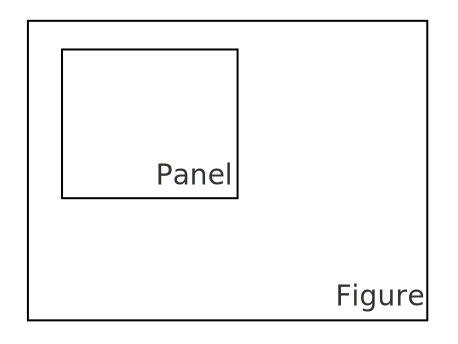

# Main Concepts

This page explains how figures, panels, and axes define the visual layout in Datoviz. It also covers how to properly position data in Normalized Device Coordinates (NDC), which all visuals require.

---

## Figures and Panels

A **figure** is a window or drawing surface. It contains one or more **panels**, which are rectangular subregions used to organize visuals.

```python
figure = app.figure(800, 600)
panel = figure.panel((50, 50), (700, 500))
```

* The panel's position and size are given in **pixels**: `(x, y)` for the top-left corner and `(w, h)` for the dimensions.
* Panels automatically resize **proportionally** when the figure window is resized.
* Customizing this behavior (e.g. fixed-size panels) will be documented soon.

<figure markdown="span">
{ width="300" }
</figure>

If you omit position and size, the panel fills the entire figure:

```python
panel = figure.panel()
```

### GUI panels

!!! warning

    This feature is experimental and may not work reliably yet.

Experimental support for GUI panels is available: instead of occupying a fixed region of the figure, a GUI panel includes a top bar and can be resized, dragged with the mouse, and docked to the window edge or to another panel. This is implemented using Dear ImGui.

To use it, enable GUI support when creating the figure with `figure = app.figure(gui=True)`. Then, for each panel you want to wrap in a GUI window, simply do:

```python
panel.gui('Panel name')
```

<figure markdown="span">

</figure>

---

## Axes (2D only)

Axes for 2D data can be added to any panel as follows:

```python
axes = panel.axes((xmin, xmax), (ymin, ymax))
```

<figure markdown="span">
{ width="600" }
</figure>

This uses a pan-and-zoom interaction pattern with the mouse. It should not be used on panels with 3D data (arcball), as 3D axes are not yet supported.

This:

* Draws X and Y axes with ticks and labels.
* Enables mouse-based **pan and zoom** interactivity.
* Defines the data limits for normalization.

---

## Coordinate system

All visuals in Datoviz expect their `position` input in **3D Normalized Device Coordinates (NDC)** — a 3D coordinate system where all values lie in the range `[-1, +1]` on each axis.

<figure markdown="span">

</figure>

The position is always an `(N, 3)` array with `x, y, z` components in NDC.

You have two options when preparing your data:

### 1. Manual normalization

If you normalize your data manually, pass it directly to the visual:

```python
norm_pos = 2 * (data - data.min()) / (data.max() - data.min()) - 1
app.point(position=norm_pos)
```

### 2. Use `axes.normalize(x, y)`

The preferred method when using 2D axes is to use the `axes.normalize()` function:

```python
axes = panel.axes((xmin, xmax), (ymin, ymax))
position = axes.normalize(x, y)
visual = app.point(position=position)
```

This does two things:

* Converts the data to NDC using the current axis limits.
* Ensures that ticks, labels, and interactivity match the transformed coordinates.

This approach keeps your data in its original units while making it compatible with the NDC rendering model.

---

## Colors

Datoviz includes built-in support for [colormaps](../reference/colormaps.md).

Most visuals and functions expect colors in `cvec4` format: four `uint8` integers in the 0–255 range representing the RGBA channels (red, green, blue, alpha).

The `dvz.cmap()` function generates an `(N, 4)` array of `uint8` RGBA values using one of the built-in colormaps. For example:

```python
color = dvz.cmap('hsv', np.linspace(-1, 1, 100), vmin=-1, vmax=+1)
# color is an (100, 4) array
```

---

## Screenshots

You can save a PNG screenshot of a figure as follows:

```python
app.screenshot(figure, 'screenshot.png')
```

!!! warning

    Screenshots currently do not support GUIs. This feature will be available in Datoviz v0.4.

---

## Summary

* Use `figure()` to create a window, and `panel()` to define drawable regions.
* Panels are defined in **pixel coordinates** and resize proportionally.
* **Axes are 2D**, provide labels/ticks, and enable interactivity.
* **All visuals require NDC input** — use `axes.normalize()` to transform and align your data easily.
