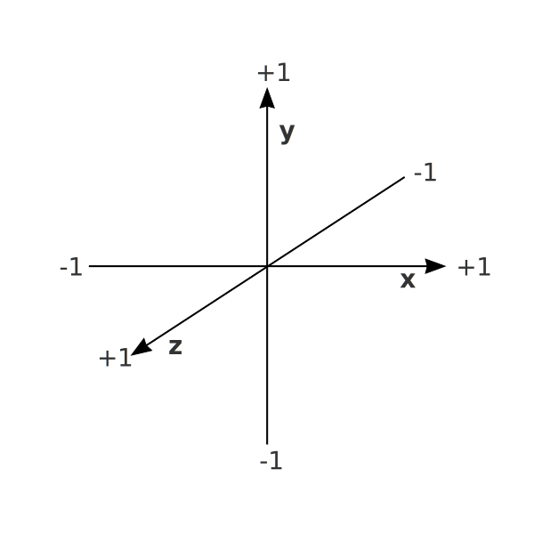

# Layout and Axes

This page explains how figures, panels, and axes define the visual layout in Datoviz. It also covers how to properly position data in Normalized Device Coordinates (NDC), which all visuals require.

---

## Figures and Panels

A **figure** is a window or drawing surface. It contains one or more **panels**, which are rectangular subregions used to organize visuals.

```python
figure = app.figure(800, 600)
panel = figure.panel((50, 50), (700, 500))
````

* The panel's position and size are given in **pixels**: `(x, y)` for the top-left corner and `(w, h)` for the dimensions.
* Panels automatically resize **proportionally** when the figure window is resized.
* Customizing this behavior (e.g. fixed-size panels) will be documented soon.

If you omit position and size, the panel fills the entire figure:

```python
panel = figure.panel()
```

---

## Axes (2D only)

Datoviz currently supports **2D axes only** (3D views have now axes for now). You can add axes to a panel using:

```python
axes = panel.axes((xmin, xmax), (ymin, ymax))
```

This:

* Draws X and Y axes with ticks and labels.
* Enables mouse-based **pan and zoom** interactivity.
* Defines the data limits for normalization.

---

## Positioning Data: NDC model

All visuals in Datoviz expect their `position` input in **3D Normalized Device Coordinates (NDC)** — a 3D coordinate system where all values lie in the range `[-1, +1]` on each axis.



The position is always an `(N, 3)` array with `x, y, z` components in NDC.

You have two options when preparing your data:

### 1. Manual normalization

If you normalize your data manually, pass it directly to the visual:

```python
norm_pos = 2 * (data - data.min()) / (data.max() - data.min()) - 1
app.point(position=norm_pos)
```

### 2. Use `axes.normalize(x, y)`

The preferred method when using 2D axes is to use the `axes.normalize()` function:

```python
axes = panel.axes((xmin, xmax), (ymin, ymax))
position = axes.normalize(x, y)
visual = app.point(position=position)
```

This does two things:

* Converts the data to NDC using the current axis limits.
* Ensures that ticks, labels, and interactivity match the transformed coordinates.

This approach keeps your data in its original units while making it compatible with the NDC rendering model.

---

## Summary

* Use `figure()` to create a window, and `panel()` to define drawable regions.
* Panels are defined in **pixel coordinates** and resize proportionally.
* **Axes are 2D**, provide labels/ticks, and enable interactivity.
* **All visuals require NDC input** — use `axes.normalize()` to transform and align your data easily.
