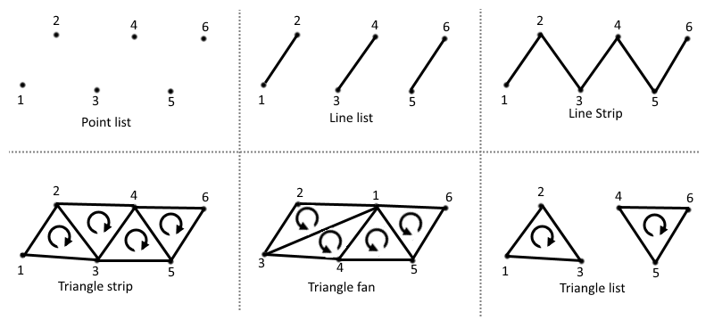

# How to write a custom graphics

!!! warning
    You need to go through the [**Vulkan crash course**](../discussions/vulkan.md) before following this guide.
    You also need to go through the [**how to write a custom visual guide**](visual.md) first.

In this section, we'll show how to **create a custom graphics** by writing **custom GLSL shaders**. This is an advanced topic as it requires understanding the basic of GPU graphics programming.

!!! note
    Only the C API supports custom graphics at the moment. Python bindings for custom graphics will come in an upcoming version. Datoviz already includes the code necessary to compile GLSL shaders to SPIR-V on the fly (based on [Khronos glslang](https://github.com/KhronosGroup/glslang/)).

The full source code for this example can be found in `examples/custom_graphics.c`.

As a toy example, we'll create **a graphics with square points of various size and color**. Specifically, we'll require each point to have a different size (which is not supported in the existing `point` graphics), and a color depending directly on the size and computed directly on the GPU. We'll use a single byte per vertex to store the vertex size (between 0 and 255 pixels), and we'll use no memory for the color since it will be determined directly by this value. This kind of memory optimization is one of the use-cases of writing custom graphics. Limiting memory usage is important when dealing with extremely large datasets (tens or hundreds of millions of points).


Writing a custom graphics involves the following steps:

1. Choosing the primitive type.
2. Defining the vertex data structure and corresponding vertex shader attributes.
3. Writing the vertex shader.
4. Writing the fragment shader.
5. Compiling the GLSL shaders to SPIR-V (may be done automatically in the future).
6. Writing the custom graphics.
7. Writing the custom visual.
8. Writing a simple test.

!!! note
    Here, we show how to create a custom graphics compatible with the scene API, so that it can be used added to the scene the same way as builtin visuals. One could however decide *not to use* the scene API at all, and leverage instead the vklite API directly. This allows one to create entirely custom and standalone applications. This is not documented at the moment, and one should look at the vklite unit tests to understand how to use the vklite API directly.


## Choosing the graphics primitive type

Vulkan supports six major types of primitives:

* **point list**: square points with an arbitrary size,
* **line list**: disjoint aliased line segments,
* **line strip**: joined aliased line segments,
* **triangle strip**: joined triangles consecutively sharing an edge,
* **triangle fan**: joined triangles all sharing a single corner (the first vertex),
* **triangle list**: disjoint triangles,

Other less common primitive types are described in the [Vulkan specification](https://www.khronos.org/registry/vulkan/specs/1.2-extensions/man/html/VkPrimitiveTopology.html).

!!! warning
    Triangle fans are not supported on macOS.


*Schematic from the [Vulkan Cookbook by Pawel Lapinski, O'Reilly](https://www.oreilly.com/library/view/vulkan-cookbook/9781786468154/f2ec181c-fca0-4121-aa67-c2cfd337a126.xhtml)*

!!! note
    The circular arrows in the triangles above indicate the orientation of the triangles, which is taken into account by the GPU. It is good practice to always ensure that all triangles constituting a given object are consistent. For example, when triangulating a square with two triangles, the order of the vertices should be chosen such that both triangles are directly oriented. The graphics pipeline can be configured to handle triangle orientation in a specific way. For example, one can make a graphics pipeline where indirectly oriented triangles are automatically discarded.

Line primitives typically have a width of 1 pixel, although some hardware supports thicker lines. In Datoviz, thick, high-quality lines are implemented with triangles instead (line triangulation), and the antialiased thick line is drawn directly in the fragment shader. "Basic" line primitives are only used for testing and for special high-performance applications where scalability and performance are more important than visual quality.

The most commonly-used primitive types in scientific visualization are essentially **point lists** and **triangle lists** (and to a lesser extent, triangle strips).

In this example, we'll use a **point list**, where each point will correspond to one square.


## Defining the vertex data structure

Once we know we'll use a point list as a primitive, the next step is to define the vertex data structure / vertex shader attributes. Here, we want the following attributes for each vertex:

* **the point position** (center of the square), as a `vec3`,
* **the point size** (edge length of the square, in pixels), as an `uint8_t`. The point size will be limited to a maximum of 255 pixels in this toy example.

We could have simply used a floating-point for the edge length, but that would have used four bytes instead of one. This is also to show the versatility of Vulkan and GPU programming, where we have full control on the data types used on both the GPU and CPU.

Here is our vertex C structure:

```c
// We define the vertex structure for our graphics pipeline.
typedef struct
{
    vec3 pos;     // 3D point position
    uint8_t size; // point size, in pixels, between 0 and 255.
} PointVertex;
```

We also need to define the attributes in GLSL:

```glsl
layout (location = 0) in vec3 pos;   // x, y, z positions
layout (location = 1) in float size; // point size, between 0.0 and 255.0
```

### Attribute format

In this example, we use a `uint8_t` (byte) on the CPU, but a `float` on the GPU. Vulkan provides a way to specify the way we want to do the **casting**. This is done when creating the graphics pipeline below. We can just say here that we'll use the Vulkan format `VK_FORMAT_R8_USCALED`. This format means that:

* **Number of components**. There is a single component (scalar), the `R` in `R8` means "red" component: this is the component used for scalar values. If using a pair of components, we would have both a `R` and `G` component (green). This naming convention using color names comes from the fact that these GPU formats are typically used to represent colors, but they can actually represent any type of numerical data.
* **Number of bits per component**. The 8 in `R8` means that our red component is represented with 8 bits.
* **Signedness**. The `U` in `USCALED` means that we use an unsigned format.
* **Scaling**. The `SCALED` means that the byte, a number between 0 and 255, will be converted to a float without normalization: 255 becomes 255.0.

Here are the other common scaling options provided by Vulkan when using bytes:

| Scaling | GPU number type | Range |
| ---- | ---- | ---- |
| `UNORM` | `float` | `[0.0, 1.0]` |
| `SNORM` | `float` | `[-1.0, 1.0]` |
| `USCALED` | `float` | `[0.0, 255.0]` |
| `SSCALED` | `float` | `[-128.0, +127.0]` (?) |
| `UINT` | `int` | `[0, 255]` |
| `SINT` | `int` | `[-128, 127]` (?) |

You'll find more information here:

* [Full list of formats in the Vulkan spec](https://www.khronos.org/registry/vulkan/specs/1.2-extensions/man/html/VkFormat.html),
* [Hardware support of the formats](http://vulkan.gpuinfo.org/listformats.php): some formats are not supported by all existing GPUs. This website is quite useful to know what formats have the best hardware support.


## Writing the vertex shader

We're now ready to write the vertex shader. Here is the full source code of the vertex shader:

<!-- CODE_GLSL examples/standalone/custom_point.vert -->

A few comments can be found below.


### Common shader resources

The `#include` directive is provided for convenience by the GLSL to SPIR-V compiler `glslc`. It is used extensively in Datoviz. It provides a simple way of making all graphics shaders share some functions and resources. In particular, we make the convention that, in order to be compatible with the scene API, **all graphics pipelines in Datoviz must have the following common slots**:

```
layout (std140, binding = 0) uniform MVP {...};
layout (std140, binding = 1) uniform Viewport {...};
```

| Binding | Descriptor type | Description |
| ---- | ---- | ---- |
| 0 | uniform | structure with the model-view-proj matrices |
| 1 | uniform | structure with viewport information |


This is done just by including `common.glsl` in every shader. Note that this is not required when using completely standalone graphics pipelines that will never be used with the scene API.

When one needs to add another bindings, the numbering should start at `USER_BINDING`, a special GLSL macro that is currently 2.

#### Uniform alignment

The `std140` keyword refers to the alignment of the fields within the uniform structure. We're not going into the details, but we'll present some relatively arbitrary rules that we follow in Datoviz so that we don't need to think too much about memory alignment considerations when working with uniform structures:

* **always use the `std140` keyword** when defining uniform resources in the shaders,
* **NEVER use the following data types in a uniform structure**: `vec3`, `ivec3`, `mat3`, and any format with a 3 in it. If you need a vector with three components, use a `vec4` and leave the last component alone. This only affects uniforms, NOT attributes.


### Varying variables

The vertex shader may pass some variables to the next stage, typically the fragment shader, using **varying variables**.

A crucial difference between the vertex and fragment shaders is that **the vertex shader executes on every vertex**, whereas **the fragment shader executes on every pixel**. When the vertex shader passes a value to the fragment shader, the GPU makes a **linear interpolation** for all pixels between two vertices in the same primitive. This is specific to line and triangle primitives, not points.

For example, passing 0 to one vertex and 1 to the next vertex in a graphics with a line primitive would result in all pixels being passed a real value between 0 and 1 depending on the position of that pixel within that line segment. This system is used in particular with:

* Color gradients,
* Texture coordinates.


### Position transformation

The `common.glsl` file defines (several overloaded versions of) the function `transform()`, which applies the model-view-proj matrices stored in the first bound resource, the `MVP` uniform. The associated C structure is `DvzMVP`:

```c
struct DvzMVP
{
    mat4 model; // model 4x4 matrix
    mat4 view;  // view 4x4 matrix
    mat4 proj;  // projection 4x4 matrix
    float time; // elapsed time since the start of the application, in seconds
};
```

The transformation is basically `gl_Position = to_vulkan(proj * view * model * position)`.

The `to_vulkan()` internal function transforms the position from the OpenGL/Datoviz 3D coordinate system (y up, z toward the user) to the Vulkan coordinate system (y down, z toward the inside of the screen).


### Special GLSL variables

We use a few special GLSL variables in the vertex shader:

| Name | Type | Description |
| ---- | ---- | ---- |
| `gl_Position` | `vec4` | final vertex position in normalized device coordinates |
| `gl_PointSize` | `float` | size of the point, when using the point list primitive |

There are many more special variables available in each type of shader. [You'll find the list of special GLSL variables here.](https://www.khronos.org/opengl/wiki/Built-in_Variable_(GLSL))


### Colormaps

The `colormap()` function is implemented in `colormaps.glsl`. It provides a GLSL implementation of a few common colormaps, which allows to compute the color as a function of a scalar value *without using a texture*. There are a few advantages to this, mostly related to performance and avoiding edge effects when using nearest interpolation in the texture.


## Writing the fragment shader

We now pass to the fragment shader. Here is the code:

<!-- CODE_GLSL examples/standalone/custom_point.frag -->


Here are a few comments.

### Clipping

Datoviz panels may have margins around them. We make the distinction between:

| Viewport | Description |
| ---- | ---- |
| inner viewport | area of the panel *excluding* the margins
| outer viewport | area of the panel *including* the margins

We follow the convention that **the normalized coordinates `[-1, +1]` correspond to the inner viewport**. Vertices beyond these limits will be rendered in the margins.

Clipping allows to hide all pixels outside the inner viewport. This is how we implement the axes controller: graphics should not be rendered in the margins which contain the tick labels. Any graphics that should be compatible with the axes controller should therefore have the special `CLIP` macro at the beginning of the fragments shader (implemented in `common.glsl`). This macro detects whether the current pixel is beyond the inner viewport, and if the graphics has been configured so, it discards that pixel.


### Special variables

We haven't used any special variable in this fragment shader, but here are two useful variables that we could use:

| Name | Type | Description |
| ---- | ---- | ---- |
| `gl_FragCoord` | `vec4` | pixel position in window space |
| `gl_PointCoord` | `vec2` | coordinates of the pixel within the point primitive |

The `gl_PointCoord` variable is reserved to graphics pipelines using a point primitive. It provides the coordinates, in pixels, of the current pixel within the square. The origin is at the upper-left corner of the square.


## Compiling the shaders to SPIR-V

Once the shaders have been written, they should be compiled to SPIR-V (unless using Datoviz to compile shaders provided as GLSL code, but this is a work in progress). Here is how to compile the shaders on the command-line:

```bash
glslc custom_point.vert -o custom_point.vert.spv
glslc custom_point.frag -o custom_point.frag.spv
```

The `glslc` command is provided by the Vulkan SDK.


## Writing the custom graphics

Here is the code to create a custom graphics compatible with the scene API, and to add it to a custom visual:

```c
// We create a blank graphics that will become our custom graphics.
DvzGraphics* graphics = dvz_blank_graphics(scene, 0);

// Custom graphics creation.

// The first step is to define the vertex and fragment shaders. When using
// dvz_graphics_shader(), one must specify a path to the compiled SPIR-V shaders.
// When writing the shaders in GLSL, it is thus necessary to compile them separately with
// glslc.
dvz_graphics_shader(graphics, VK_SHADER_STAGE_VERTEX_BIT, "custom_point.vert.spv");
dvz_graphics_shader(graphics, VK_SHADER_STAGE_FRAGMENT_BIT, "custom_point.frag.spv");

// We define the graphics pipeline topology: point list here.
dvz_graphics_topology(graphics, VK_PRIMITIVE_TOPOLOGY_POINT_LIST);

// Next, we declare the size of our vertex structure.
dvz_graphics_vertex_binding(graphics, 0, sizeof(PointVertex));

// We now declare the vertex shader attributes, that should correspond to the different
// structure fields in the vertex structure.

// The first attribute is a vec3 in GLSL, and a vec3 in C too.
dvz_graphics_vertex_attr(
    graphics, 0, 0, VK_FORMAT_R32G32B32_SFLOAT, offsetof(PointVertex, pos));

// The second attribute is a float in GLSL, and a byte (uint8) in C. We use the special
// format VK_FORMAT_R8_USCALED to declare this.
dvz_graphics_vertex_attr(
    graphics, 0, 1, VK_FORMAT_R8_USCALED, offsetof(PointVertex, size));

// Now that we've set up the graphics, we create it.
dvz_graphics_create(graphics);

// We add our custom graphics to a custom visual.
dvz_custom_graphics(visual, graphics);
```

As shown here, the creation of a custom graphics involves the following steps:

* Defining the shaders,
* Defining the primitive type,
* Declaring the vertex structure, the format of each field, and the casting between the GPU and GPU.

There are further functions in the vklite API to customize the creation of the graphics pipeline. Refer to the Datoviz C API reference for more details.


## Writing the custom visual

Here is how to add a custom graphics to a custom visual:

```c
// We create a blank visual, to which we'll add our custom visual.
DvzVisual* visual = dvz_blank_visual(scene, DVZ_VISUAL_FLAGS_TRANSFORM_NONE);

// ... creating the custom graphics...

// We add our custom graphics to a custom visual.
dvz_custom_graphics(visual, graphics);
```

At this point, the custom visual contains common sources (vertex, MVP, viewport) and props. One could then define more sources and props.


## Writing a simple test

Finally, here is how to use our custom visual with a custom graphics:

```c
// ... creating the custom visual with the custom graphics...

// We add the custom visual to the panel.
dvz_custom_visual(panel, visual);

// Now, we prepare the vertex data. We could have defined and used props, but we'll show
// another method instead. We create the vertex buffer directly, using the PointVertex
// structure we've created.
const uint32_t N = 64;                                  // number of points
PointVertex* vertices = calloc(N, sizeof(PointVertex)); // vertex buffer
float t = 0;
for (uint32_t i = 0; i < N; i++)
{
    t = i / (float)(N - 1);
    // vertex position
    vertices[i].pos[0] = -.75 + 1.25 * t * t;
    vertices[i].pos[1] = +.75 - 1.25 * t;
    // vertex size, in byte, between 0 and 255.
    vertices[i].size = 4 * i + 1;
}

// Here is the crucial bit: we bind the GPU vertex buffer with our struct array.
dvz_visual_data_source(visual, DVZ_SOURCE_TYPE_VERTEX, 0, 0, N, N, vertices);
FREE(vertices);
```

Here are a few comments:

* Instead of using visual props, we have defined the vertex structure directly. The whole point of the visual props is to avoid doing this, which may not be particularly easy with complex vertex shaders with many attributes. Also, setting the vertex buffer directly requires to understand how the graphics is implemented on the GPU. If some form of triangulation is required, it is up to the user to do it. In this particular example, there is no triangulation as we have a one-to-one correspondance between the squares and the vertices.
* Note that the data buffers passed to the `dvz_visual_data*()` functions make a copy of the data, so we're fine freeing it.


## Other topics

We didn't yet cover these other aspects:

* Other resources (textures, other uniforms),
* Other shaders (geometry shader, tesselation shader),
* Indexed rendering,
* Indirect rendering,
* Fixed functions,
* Depth testing,
* Dynamic states,
* Specialization constants,
* Push constants,
* Custom command buffers,
* Interaction with compute shaders,
* And many other topics...
