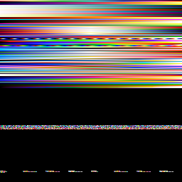

---
hide:
  - navigation
  - title
  - toc
---

<main class="dvz-public-landing" markdown="1">

<nav class="dvz-public-nav" aria-label="Landing navigation">
<a class="dvz-public-nav__brand" href="./">Datoviz</a>
v0.4 RC
<a href="../examples/">Examples</a>
<a href="../">Docs</a>
<a href="https://github.com/datoviz/datoviz">GitHub</a>
</nav>

<section class="dvz-public-hero" markdown="1">

C-first scientific GPU visualization

# Datoviz

A native rendering engine for large scientific scenes: retained visuals, precise interaction,
replayable command streams, and a Vulkan-first runtime with low-level Python integration.

Datoviz is the engine layer in the GSP/VisPy2 direction. The high-level plotting layer is still work
in progress; today you can use Datoviz directly from C or through the generated Python `ctypes`
binding.

[View Examples](../examples/showcases.md){ .md-button .md-button--primary }
[Read the Docs](../start/index.md){ .md-button }

Scene API
DRP2
Vulkan
WebGPU preview

<strong>Retained GPU visuals</strong>
images · meshes · volumes · points · text

<strong>10M+</strong>
interactive marks target

<strong>v0.4</strong>
Release candidate

</section>

<section class="dvz-public-showcases" markdown="1">

## Visual Proof Targets

<a class="dvz-public-card" href="../examples/gallery/showcases/showcases_point_cloud/" markdown="1">
01
<strong>Dense LiDAR</strong>
<em>Large point clouds with direct color, depth, and metric navigation.</em>
</a>

<a class="dvz-public-card" href="../examples/gallery/showcases/showcases_protein/" markdown="1">
02
<strong>Molecular Arcball</strong>
<em>Clustered spheres and interactive 3D inspection for real scientific data.</em>
</a>

<a class="dvz-public-card" href="../examples/gallery/showcases/showcases_brain_volume/" markdown="1">
03
<strong>Brain Volume</strong>
<em>Volume data, slices, transparent mesh overlays, and annotations.</em>
</a>

<a class="dvz-public-card" href="../examples/gallery/showcases/showcases_wind_field/" markdown="1">
04
<strong>Weather Field</strong>
<em>Scalar fields, vector overlays, colorbars, and probe readback.</em>
</a>

<a class="dvz-public-card" href="../examples/gallery/showcases/showcases_choropleth/" markdown="1">
05
<strong>Choropleth</strong>
<em>Retained polygon composites with labels, color scales, and resizing proof.</em>
</a>

<a class="dvz-public-card" href="../reference/webgpu-subset/" markdown="1">
06
<strong>WebGPU Preview</strong>
<em>Browser rendering experiments backed by the shared scene contract.</em>
</a>

</section>

<section class="dvz-public-bands" markdown="1">

## Engine Layer

Use Datoviz directly for native C APIs, embedding, offscreen rendering, replayable render streams,
backend work, and exact control over retained GPU resources.

## Python Boundary

Datoviz v0.4 owns one generated Python binding: `datoviz` accepts documented NumPy arrays, while
`datoviz.raw` exposes the same binding's exact pointer/count call form. High-level plotting belongs
to GSP/VisPy2, with Datoviz as a backend when that layer is ready.

## Release Status

v0.4 is a release candidate. Supported and experimental surfaces stay explicitly
labelled in the docs and examples.

</section>

</main>
