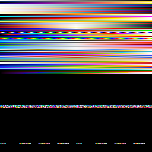

# Colormaps

Visky natively includes a collection of common colormaps, both continuous and discrete (color palettes). These colormaps come from the following sources:

* matplotlib
* bokeh
* colorcet
* [Kenneth Moreland's page](https://www.kennethmoreland.com/color-advice/)

{: align=right }
These colormaps are stored in a 256x256 texture. Each row contains either:

* a 256-color continuous colormap,
* a 256-color discrete color palette,
* eight discrete 32-color palettes.

Unused space may be used for future or user-defined colormaps. The texture is always loaded both in CPU and GPU memory. It is shared between all visuals and canvases.

Visky provides a few functions to easily make colors out of scalar values:

=== "Python"
    ```python
    from visky import colormap
    colors = colormap(values, vmin=0, vmax=1, cmap=X)
    ```

=== "C"
    ```c
    vkl_colormap(cmap, value, color);
    vkl_colormap_scale(cmap, value, vmin, vmax, color);
    vkl_colormap_array(cmap, count, values, vmin, vmax, colors);
    ```

<!-- The list of colormaps is generated in a mkdocs hook from utils/export_colormap.py -->
