# Visuals

!!! note
    Props marked *uniform* correspond to the params structure available to the shader as a uniform variable. Each uniform param is shared across all vertices of a given visual. Therefore, these props can receive only a single value.

## 2D visuals

### Marker

#### Props

| Type | Index | Type | Description |
| ---- | ---- | ---- | ---- |
| `pos` | 0 | `dvec3` | marker position |
| `color` | 0 | `cvec4` | marker  color |
| `marker_size` | 0 | `float` | marker size |
| `marker_type` | 0 | `char` | marker type |
| `angle` | 0 | `char` | marker angle, between 0 (0) and 256 (`M_2PI`) excluded |
| `transform` | 0 | `char` | transform enum |
| `color` | 1 | `vec4` | edge color (*uniform*) |
| `line_width` | 0 | `float` | edge line width (*uniform*) |

#### Marker types

| Marker | Value | Image |
| ---- | ---- | ---- |
| `disc` | 0 | 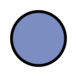 |
| `asterisk` | 1 |  |
| `chevron` | 2 | 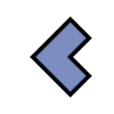 |
| `clover` | 3 | 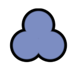 |
| `club` | 4 | 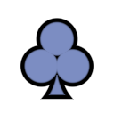 |
| `cross` | 5 | 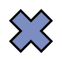 |
| `diamond` | 6 | 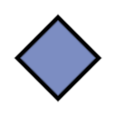 |
| `arrow` | 7 |  |
| `ellipse` | 8 | 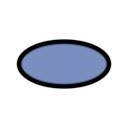 |
| `hbar` | 9 |  |
| `heart` | 10 |  |
| `infinity` | 11 | 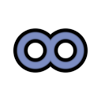 |
| `pin` | 12 |  |
| `ring` | 13 | 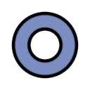 |
| `spade` | 14 | 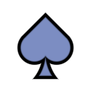 |
| `square` | 15 | 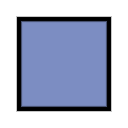 |
| `tag` | 16 | 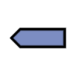 |
| `triangle` | 17 | 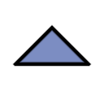 |
| `vbar` | 18 | 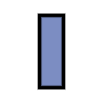 |

### Axes

#### Tick level

| Index | Level | Description |
| ---- | ---- | ---- |
| 0 | `minor` | minor ticks |
| 1 | `major` | major ticks |
| 2 | `grid` | grid |
| 3 | `lim` | axes delimiters |

#### Graphics

| Index | Graphics | Description |
| ---- | ---- | ---- |
| 0 | `segment` | ticks (minor, major, grid, lim) |
| 1 | `text` | tick labels |

#### Sources

| Type | Index | Graphics | Description |
| ---- | ---- | ---- | ---- |
| `vertex` | 0 | `segment` | vertex buffer for ticks |
| `index` | 0 | `segment` | index buffer for ticks |
| `vertex` | 1 | `text` | vertex buffer for labels |
| `index` | 1 | `text` | index buffer for labels |
| `font_atlas` | 0 | `text` | font atlas for labels |

#### Props

| Type | Index | Type | Graphics | Description |
| ---- | ---- | ---- | ---- | ---- |
| `pos` | any level | `double` | `segment` | tick positions in data coordinates |
| `color` | any level | `cvec4` | `segment` | tick colors |
| `line_width` | any level | `float` | `segment` | tick line width |
| `length` | `minor` | `float` | `segment` | minor tick length |
| `length` | `major` | `float` | `segment` | major tick length |
| `text` | 0 | `str` | `text` | tick labels text |
| `text_size` | 0 | `float` | `text` | tick labels font size |

## 3D visuals

### Mesh

#### Props

| Type | Index | Type | Description |
| ---- | ---- | ---- | ---- |
| `pos` | 0 | `dvec3` | line start position |
| `pos` | 1 | `dvec3` | line end position |
| `color` | 0 | `color` | line color |

## Basic visuals

The basic visuals are simpler and more efficient, but they do not support antialiasing.

### Point

The **point** visual is a trimmed-downed version of the **marker** visual. It is based on the `point` primitive.

#### Props

| Type | Index | Type | Description |
| ---- | ---- | ---- | ---- |
| `pos` | 0 | `dvec3` | point position |
| `color` | 0 | `cvec4` | point color |
| `marker_size` | 0 | `float` | point size (*uniform*) |

### Line

#### Props

| Type | Index | Type | Description |
| ---- | ---- | ---- | ---- |
| `pos` | 0 | `dvec3` | line start position |
| `pos` | 1 | `dvec3` | line end position |
| `color` | 0 | `color` | line color |

## Common data

The sources and props below are shared by all builtin visuals.

### Common sources

| Type | Index |  Description |
| ---- | ---- | ---- |
| `mvp` | 0 | `VklMVP` structure with model-view-proj matrices |
| `viewport` | 0 | `VklViewport` structure with viewport info |

### Common props

| Type | Index | Type | Source | Description |
| ---- | ---- | ---- | ---- | ---- |
| `model` | 0 | `mat4` | `mvp` | model transformation matrix |
| `view` | 0 | `mat4` | `mvp` | view transformation matrix |
| `proj` | 0 | `mat4` | `mvp` | proj transformation matrix |
| `time` | 0 | `float` | `mvp` | time since app start, in seconds |

### Visual transform

### Visual clip
