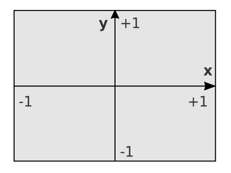

# Image Visual

The **image** visual displays 2D textures (images) anchored at a position in 3D space. It supports flexible anchoring, sizing in pixels or NDC, rescaling behavior, borders, and color mapping for single-channel data.

---

## Overview

- Displays RGBA or single-channel images in a 2D panel
- Anchored at a 3D NDC position using a configurable alignment point
- Size can be set in either **pixels** or **NDC units**
- Supports borders, round corners, and rescaling behavior
- Image data can be full color or colormapped from single-channel textures

---

## When to use

Use the image visual when:
- You need to overlay 2D raster data (e.g. camera frames, microscope images)
- You want precise control over alignment and size
- You need to visualize single-channel arrays with a colormap

---

## Attributes

Each item in the visual is a single image. Multiple images can be efficiently displayed at different positions in the same visual. Currently, all images in a given visual must share the same texture image, though they can use different texture coordinates.


### Per-image

| Attribute     | Type                 | Description                                      |
|---------------|----------------------|--------------------------------------------------|
| `position`    | `(N, 3) float32`     | Anchor point for the image (in NDC coordinates) |
| `size`        | `(N, 2) float32`     | Image width and height                          |
| `anchor`      | `(N, 2) float32`     | Relative point in the image attached to position |
| `texcoords`   | `(N, 4) float32`     | Texture coordinates (default is `(0, 0, 1, 1)`)  |
| `facecolor`   | `(N, 4) uint8`       | Fill color (used in `fill` mode)                |

### Uniform

| Attribute     | Type         | Description                                         |
|---------------|--------------|-----------------------------------------------------|
| `edgecolor`   | `cvec4`      | Color of the border edge                           |
| `linewidth`   | `float`      | Width of the border in pixels                      |
| `radius`      | `float`      | Border corner radius (for rounded edges)           |
| `colormap`    | enum         | Colormap used in `colormap` mode                   |
| `permutation` | `ivec2`      | Axis swizzle for texture sampling (e.g. `(1, 0)`)  |
| `texture`     | texture      | Texture object (RGBA or single-channel)            |

---

## Anchor point

The `anchor` attribute defines which part of the image rectangle is attached to the `position` coordinate in NDC space.

The anchor is specified as a 2D vector in the range `[-1, +1]`:

- `[-1, -1]` — bottom-left corner
- `[0, 0]` — center of the image
- `[+1, +1]` — top-right corner

For example, setting `anchor = [0, 0]` will center the image at the given `position`.
Setting `anchor = [-1, +1]` will attach the top-left corner to the anchor position.

This allows precise placement of the image relative to your coordinate system.

{ width="500" }
/// caption
Image anchor point
///

---

## Keyword Options

When creating an image visual, several options influence its behavior:

### `unit`
Specifies how the image `size` is interpreted:

- `pixels` *(default)* — size is in framebuffer pixels
- `ndc` — size is relative to panel NDC coordinates

### `mode`
Specifies how image data is interpreted:

- `rgba` *(default)* — full RGBA image
- `colormap` — single-channel image with a colormap
- `fill` — fill with uniform `facecolor` (no texture needed)

### `rescale`
Controls how the image behaves when zooming or resizing:

- `None` *(default)* — fixed size, no scaling
- `rescale` — image scales with panel zoom
- `keep_ratio` — image scales while maintaining its aspect ratio

### `border`
Enable a border around the image. When `True`, the following attributes are used:

- `edgecolor`: color of the border
- `linewidth`: thickness in pixels
- `radius`: corner rounding radius

---

## Texture Swizzling

The `permutation` attribute controls how texture axes are interpreted.
For example, `(0, 1)` is the default (UV); `(1, 0)` uses VU instead.

This can be useful when image data is stored with flipped or transposed axes.

---

## Example

```python
--8<-- "examples/visuals/image.py"
```

---

## Summary

The image visual provides flexible placement and styling of 2D textures.

* ✔️ Position, anchor, and size control
* ✔️ Borders, round corners, and rescaling
* ✔️ Support for colormaps and single-channel data

See also:

* [Pixel](pixel.md): for sparse or point-based raster plots
* [Volume](volume.md): for 3D scalar field visualization
